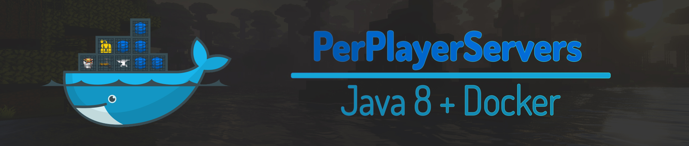

[](https://github.com/DaddyImPregnant/PerPlayerServers/actions/workflows/windows-java-maven.yml)
[](https://github.com/DaddyImPregnant/PerPlayerServers/actions/workflows/linux-java-maven.yml)
[](https://github.com/DaddyImPregnant/PerPlayerServers/actions/workflows/macos-java-maven.yml)

# PerPlayerServers
Simplify server creation with Docker and make it possible to create servers on the fly for things like PvP battles, events, and even per-match servers.

## Overview
This is a project being developed by the community, and is not affiliated with any of the companies belonging to [Mojang](https://mojang.com), [Microsoft](https://www.microsoft.com) and [Docker](https://www.docker.com). The project is developed with Java version 8 making it possible to run it on most servers today, and with the build automation tool called Maven.

## How to build
```bash
git clone https://github.com/DaddyImPregnant/PerPlayerServers.git
cd PerPlayerServers
mvn
```

## Contributions
This project will always remain open source and any kind of contribution is welcome. By participating in this project, you agree to keep common sense and contribute in a positive way.